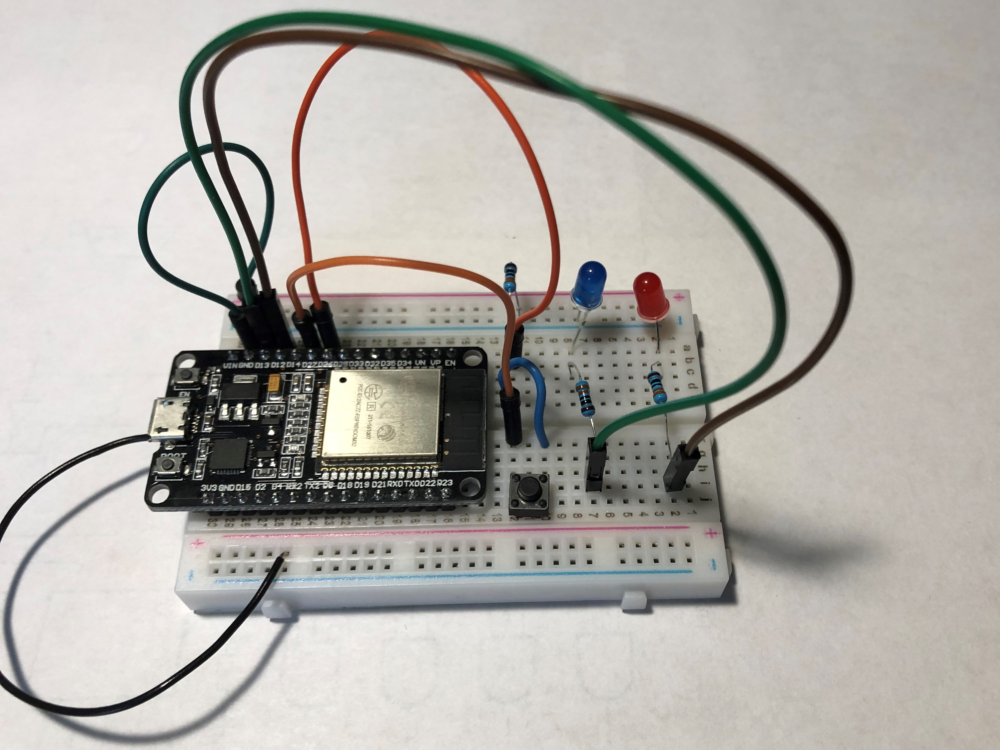

# arduinoTrafficController
A light and walk signal controlled using an arduino.

## Overview
 The arduinoTrafficController specifically works with a single traffic light and walk signal. Although, adding more signals would not be too difficult. As the traffic light only has 3 I/O, one for each light, the real programming lies with the walk signal. Normally the walk signal interacts with the rest of an intersection. It receives input through two terminals and gauges the count-down timer based on the information it receives. The walk signal begins in a programming phase in which it needs two full cycles of input to determine the timer. Below the important rules are summarized from http://www.signalcontrol.com/.

### Stipulations
* The count-down timer will only be active during a flashing hand. No other time.
* The count-down timer will not show until the initial cycle of flashing the stop hand.
* The count-down timer will adapt the time based on the cycles determined by the flashing hand.
* The flashing hand should hold solid at exactly 0 seconds. More flashing will result in a progressively longer count down.
* Undetermined rule, 4.8.7. 
* After two consistent cycles, one reduced cycle will not change the timer.
* Undetermined rule, 4.8.9.
* Lack of power or power to both walk and stop will cause the walk signal to reset.
* Switches on the back of the unit can be changed to put the walk signal into different modes.

http://www.signalcontrol.com/tech_papers/dialight/Dialight_LED_Ped_Modules_Spec_10-20-08.pdf

